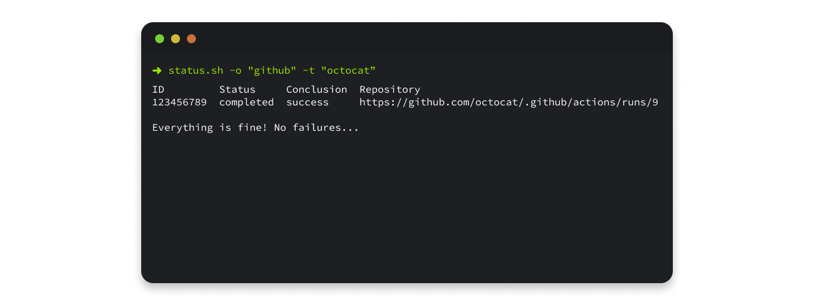

<br />
<h1>
  <p align="center">
    
  <br>status
  </p>
</h1>
<p align="center">
A simple script to get workflow status & conclusion of either all workflows in an GitHub organisation or repositories belonging to a GitHub team.
</p>

Heavily influenced by [LF Workflow Dash](https://github.com/lincc-frameworks/lf-workflow-dash)

## Prerequisites

- [git](https://git-scm.com/book/en/v2/Getting-Started-Installing-Git)
- [gh-cli](https://github.com/cli/cli?tab=readme-ov-file#installation)
- [jq](https://jqlang.github.io/jq/download/)

## Usage

Status scan uses GitHub API to check status of owners workflow and will produce 2 files, `active_repos.txt` and if a workflow run has been concluded a failure it will create a file `failed_workflows.txt`  

**Tip:** If you have certain workflows that is vital, you can have a check if file `failed_workflows.txt` exists, alerts a slack channel with failed workflows detected on a schedule.

1. Clone repository

   ```sh
   git clone https://github.com/psilore/status.git
   ```

1. Navigate to directory

   ```sh
   cd status
   ```

### Scan all workflows in an GitHub organisation

```sh
bash status.sh -o [OWNER]
```

### Scan all workflows of a GitHub team within an organisation

```sh
bash status.sh -o [OWNER] -t [TEAM_SLUG]
```
